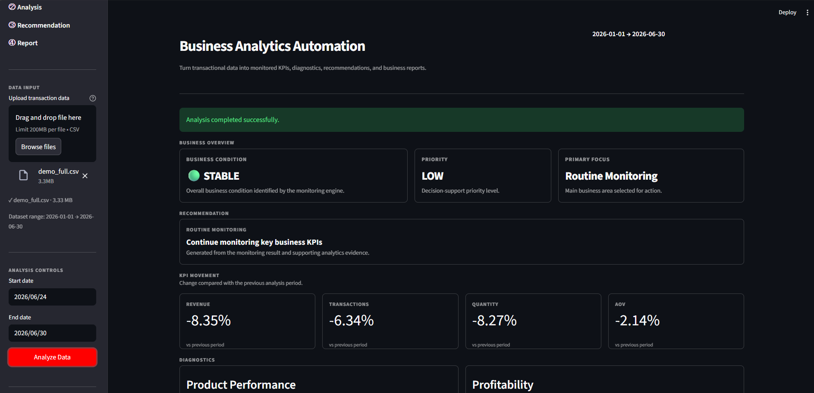

# Business Analytics Automation Engine

A reusable analytics workflow that transforms transactional data into business performance insights, monitoring signals, recommendations, and decision-ready reports.

## Overview

Recurring business analysis often involves repetitive tasks such as data preparation, KPI calculation, period comparison, performance monitoring, issue diagnosis, and reporting.

This project builds a reusable analytics workflow that automates these steps from transactional data to decision-ready business output.

The system accepts CSV-based transaction data, validates and standardizes the input, analyzes business performance, detects meaningful movements, generates rule-based recommendations, and produces a business report through an interactive Streamlit interface.

The project is designed as a human-triggered analytics automation workflow rather than a fully autonomous business intelligence platform.

## Problem

Recurring business performance analysis can become repetitive when each reporting cycle requires manual data preparation, KPI calculation, comparison with previous periods, issue identification, and report generation.

## Solution

This project automates the repeatable analytical workflow so users can provide transactional data and receive:

- Standardized and validated data
- KPI movement analysis
- Business monitoring signals
- Diagnostic findings
- Deterministic recommendations
- A generated business report

## Workflow

```text
Transactional Data
        │
        ▼
Schema Mapping
        │
        ▼
Data Quality Validation
        │
        ▼
Data Preparation
        │
        ▼
Analytics Engine
        │
        ▼
Monitoring & Diagnosis
        │
        ▼
Recommendation Engine
        │
        ▼
Business Report
        │
        ├──────────────► Streamlit UI
        │
        └──────────────► Email Delivery
```

## Key Features

### Flexible Input Schema

The system maps common business column names into a canonical schema, allowing different CSV formats to be processed without changing the analytics logic.

### Data Quality Validation

Required fields are validated before analysis. Invalid optional data can reduce available analytical capabilities, while critical data-quality errors stop the pipeline.

### Business Performance Monitoring

The analytics engine evaluates period-over-period movements across available KPIs such as revenue, transactions, quantity, and average order value.

### Product Performance Analysis

When product and quantity data are available, the system identifies product-level movements and material declines.

### Profitability Analysis

When cost or profit data are available, the system evaluates profit, margin, cost per unit, and revenue per unit movements.

### Deterministic Recommendation Engine

Business recommendations are generated using explicit analytical rules rather than AI-generated decisions.

### Automated Business Reporting

Analysis results are transformed into a structured business report for download or email delivery.

### Interactive Streamlit Interface

Users can upload transaction data, select an analysis period, review findings, download reports, and send reports to a selected recipient.

## Business Scenarios

The system was tested against multiple synthetic business scenarios designed to represent different performance conditions.

| Scenario | Detected Condition | Primary Focus |
|---|---|---|
| Normal | Stable | Routine Monitoring |
| Promotion | Positive Sales Movement | Promotion Economics |
| Product Decline | Product-Specific Issue | Product Performance |
| Cost Pressure | Profitability Risk | Cost Structure |
| Sales Drop | Negative Sales Movement | Transaction Volume |
| Recovery | Positive Sales Movement | Growth Sustainability |

## Example Result

The Streamlit interface summarizes the detected business condition, KPI movements, diagnostic findings, recommendations, and available report actions in a single workflow.



## Dataset

The project uses a synthetic transactional dataset representing a fictional single-outlet F&B business.

The dataset was created to support controlled testing of different business conditions, including promotional periods, product-specific declines, cost pressure, sales drops, and recovery periods.

Sample datasets are provided in `data/sample/` for testing the application without requiring an external data source.

## Input Schema

The minimum required fields are:

| Column | Required | Purpose |
|---|---|---|
| `date` | Yes | Defines analysis periods |
| `revenue` | Yes | Revenue analysis |

Optional fields enable additional capabilities:

| Column | Enables |
|---|---|
| `transaction_id` | Transaction count and AOV |
| `quantity` | Quantity and product analysis |
| `product` | Product performance analysis |
| `cost` | Profitability analysis |
| `profit` | Profitability analysis |

Missing optional fields do not necessarily prevent the pipeline from running. The system degrades gracefully by disabling the analytical capabilities that depend on unavailable data.

## Tech Stack

- Python
- Pandas
- Streamlit
- python-dotenv
- SMTP / Gmail for email delivery

## Project Structure

```text
business_automation/
│
├── app/
│   └── app.py
│
├── src/
│   ├── analytics/
│   ├── data_generator/
│   └── validation/
│
├── data/
│   ├── sample/
│   ├── generated/
│   └── uploads/
│
├── config/
├── notebooks/
│
├── .env.example
├── .gitignore
├── requirements.txt
└── README.md
```

## Setup

### 1. Clone the repository

```bash
git clone <repository-url>
cd business_automation
```

### 2. Install dependencies

```bash
pip install -r requirements.txt
```

### 3. Configure environment variables

Copy `.env.example` to `.env` and configure the required SMTP settings.

### 4. Run the application

```bash
streamlit run app/app.py
```

## Usage

1. Upload a CSV transaction dataset.
2. Select the analysis period.
3. Run the analysis.
4. Review business status, KPI movements, diagnostics, and recommendations.
5. Download the generated business report.
6. Optionally enter a recipient email address and send the report.

The application automatically adjusts available analysis based on the fields present in the uploaded dataset.

## Outputs

The pipeline generates:

- `analysis_result.json` — structured analytical results
- `recommendation_result.json` — generated recommendations and supporting evidence
- `business_report.md` — business-facing report

Generated files are stored in `data/generated/` at runtime.

## Testing

The workflow was validated using multiple scenarios and input conditions:

- Normal business period
- Promotional period
- Product-specific decline
- Cost pressure
- Sales drop
- Recovery period
- Invalid input rows
- Critical data-quality errors
- Minimal datasets with limited fields
- Alternate column naming
- Invalid email addresses

Expected analytical behavior was verified across the different business scenarios to ensure that monitoring signals and recommendations respond to changes in business conditions rather than relying on a single predefined outcome.

## Design Principles

### Separation of Concerns

The analytical pipeline, user interface, and email delivery are separated into different layers.

### Capability-Aware Analysis

Analytical modules adapt to the available fields in the input dataset instead of requiring every optional field.

### Deterministic Recommendations

Recommendations are generated from explicit business rules and analytical evidence, making the decision logic transparent and reproducible.

### Reusable Workflow

The core pipeline is designed to be reusable across different CSV-based transactional datasets rather than being tied to a single dataset or business case.

## Limitations

- The current system uses CSV-based transactional input.
- Analysis is human-triggered through the Streamlit interface.
- The system does not currently perform scheduled data ingestion.
- External workflow orchestration tools such as n8n are not part of the current implementation.
- Synthetic datasets are used for demonstration and controlled testing.

## Future Improvements

Potential extensions include:

- Scheduled data ingestion
- Database-based data sources
- Automated recurring analysis
- External workflow orchestration
- Additional notification channels
- Richer monitoring history and trend analysis

## Project Focus

This project focuses on building a reusable analytics workflow that connects data preparation, business analysis, monitoring, recommendation logic, reporting, and delivery into a single system.

It is intended as a demonstration of practical data analytics, Python-based workflow design, and business-oriented decision support.
